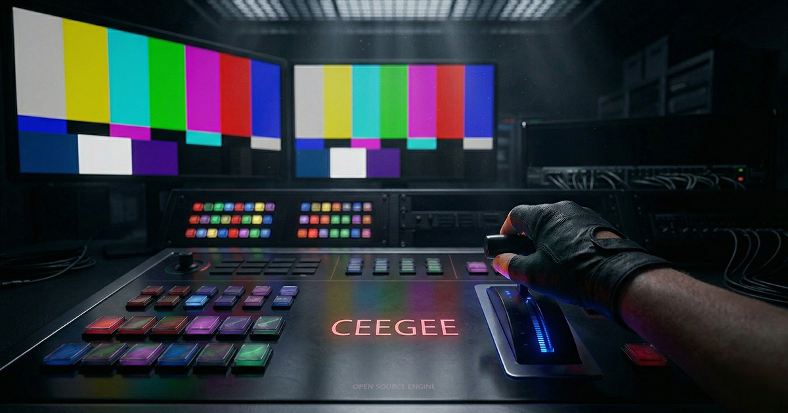

# CeeGee

A self-hosted **HTML graphics engine** and **web control UI** for broadcast-style overlays. Built with Nuxt 4, Vue 3, and GSAP.

Outputs transparent HTML overlays for OBS Browser Source. Operator UI controls what's on air. Producer UI manages the content. WebSocket keeps everything in sync.

## Quick start

```bash
pnpm install
pnpm dev
```

Open [http://localhost:3000](http://localhost:3000), create a workspace, and start building graphics.

| URL | What it does |
|-----|-------------|
| `/app` | Workspace dashboard |
| `/app/:id/producer` | Manage channels, layers, elements |
| `/app/:id/operator` | Live TAKE/CLEAR control |
| `/o/:id/channel/:id` | OBS Browser Source overlay |

## Documentation

### For users

- [Getting Started](docs/user/getting-started.md) -- install, first run, create your first workspace
- [Core Concepts](docs/user/concepts.md) -- workspaces, channels, layers, elements, modules
- [Producer Guide](docs/user/producer-guide.md) -- build and manage show structure
- [Operator Guide](docs/user/operator-guide.md) -- live show control (take/clear)
- [OBS Setup](docs/user/obs-setup.md) -- connect overlays to OBS Browser Source
- [Modules Reference](docs/user/modules-reference.md) -- built-in module config and actions

### For developers

- [Getting Started](docs/developer/getting-started.md) -- dev environment setup
- [Architecture](docs/developer/architecture.md) -- monorepo layout, data flow, tech stack
- [Engine Core](docs/developer/engine-core.md) -- database, CRUD functions, engine logic
- [Modules](docs/developer/modules.md) -- how to create a graphics module
- [Engine UI](docs/developer/engine-ui.md) -- Nuxt app structure, composables, routing
- [WebSocket Protocol](docs/developer/websocket-protocol.md) -- events, state model, connection lifecycle
- [Testing](docs/developer/testing.md) -- Vitest setup, patterns, conventions

## Tests

```bash
pnpm test
```

## License

MIT
